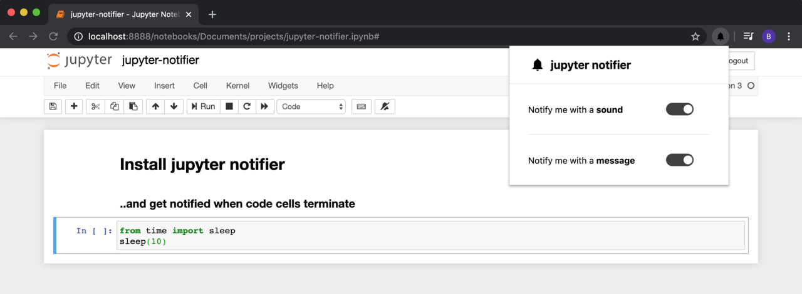
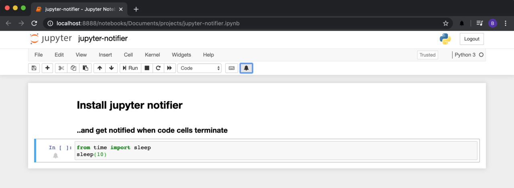
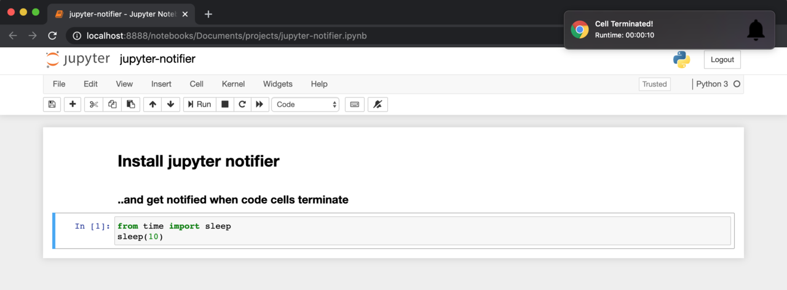

## Jupyter Notifier
**Jupyter Notifier** is a Google Chrome extension that notifies you when code cells terminate.

## Description
On every Jupyter Notebook environment, Jupyter Notifier allows you to select specific cells for notification. For this, Jupyter Notifier injects a button  into your notebook. You can get notified you with a sound, a message, or both when code cells terminate. 

With Jupyter Notifier, you won't be repeatedly checking whether your cell has finished running.

## Installation
**Jupyter Notifier** is currently in pending review and will be available in the Chrome Web Store soon.

## Screenshots

---
With clicking the button , the selected cell(s) will notify you on termination.
**Jupyter Notifier** adds an indicator next to the selected cell(s).

---
On termination of a subscribed cell, given 'Notify me with a **message**' is activated, you'll get a notification containing the runtime of the cell.

## Contribute 
TBD

## License
MIT © Baran Yildirim
